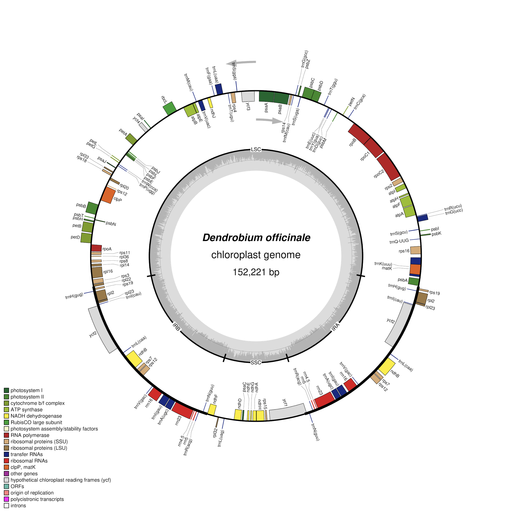

## Visualize Plastid Genome Structure

## Student Information

**Name:** Gaze Everly M. Abrasaldo 
**Course:** Cell & Molecular Biology

## Chosen Organism

**Scientific name:** *Dendrobium officinale*  
**Plastid genome accession:** NC_024019.1  
**Genome length:** 152,221 bp

## Genome Source

The annotated plastid genome was obtained from the **NCBI RefSeq** record for *Dendrobium officinale*.

**Accession:** NC_024019.1  
**Source:** NCBI RefSeq

## OGDRAW Visualization

The plastid genome was visualized using **OGDRAW**.

**OGDRAW:** https://chlorobox.mpimp-golm.mpg.de/OGDraw.html 

The annotated GenBank file for *Dendrobium officinale* (NC_024019.1) was uploaded to OGDRAW. The following settings were used:

- Mode: Standard
- Map: Circular
- Sequence source: Plastid
- Inverted repeats: Automatic detection
- GC content graph: Enabled
- Direction of transcription: Enabled
- Full legend: Enabled
- Intron-containing genes labeled with `*`: Enabled
- Output format: PNG
- Resolution: Fine

## Plastid Genome Map

The resulting OGDRAW map displays the organization of the *Dendrobium officinale* chloroplast genome.

## Structural Features

The *Dendrobium officinale* chloroplast genome is organized into four major regions: the Large Single-Copy (LSC) region, Small Single-Copy (SSC) region, and two inverted repeat regions, IRa and IRb. Protein-coding genes, tRNA genes, and rRNA genes are distributed throughout the genome. Genes within the inverted repeat regions can occur in both IRa and IRb because these regions are duplicated. The arrows on the map indicate the direction of transcription. The inner GC content graph shows variation in GC content across different parts of the genome.

## Answers

The answers to the plastid genome questions are available in:

[Plastid Genome Questions](answers/Lab_plastid_genome_answers.md)

## Files in This Activity

- `data/` — annotated GenBank file used for the visualization
- `figures/` — final OGDRAW plastid genome map
- `answers/` — answers to the plastid genome questions
- `README.md` — documentation of the activity and workflow
